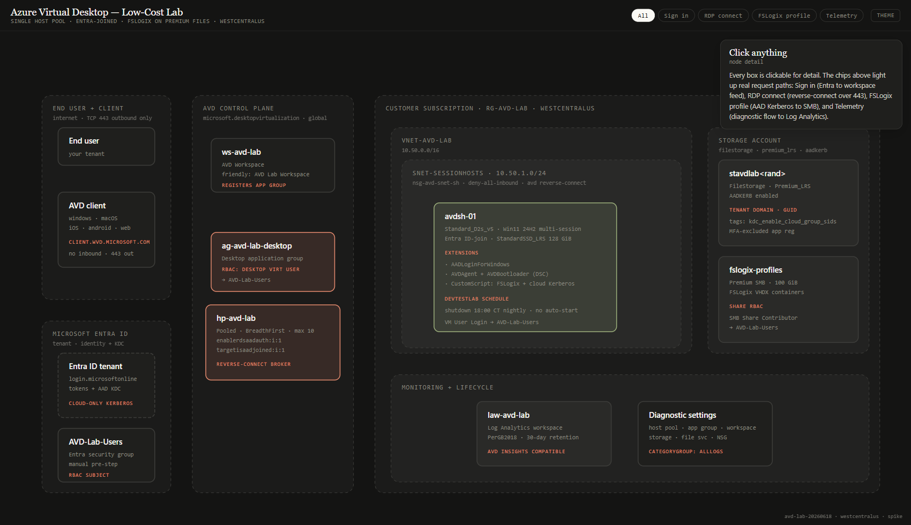

# AVD Low-Cost Lab

Personal low-cost Azure Virtual Desktop learning lab — Entra ID-join, FSLogix on Azure Files with Entra Kerberos, one session host, auto-shutdown, ~$25-75/month depending on usage.

> **Verified working** end-to-end on 2026-06-18: bicep apply succeeded, session host showed `Available`, `dsregcmd /status` reported `AzureAdJoined: YES`, and the AVD client successfully connected to the desktop. See [Lessons learned](#lessons-learned) below for what to watch out for.

This repository is meant to be reproducible by anyone with an Azure subscription, a test user, and permission to create resource groups, role assignments, virtual machines, storage accounts, and Azure Virtual Desktop resources.

## Contents

- [Architecture](#architecture)
- [What gets deployed](#what-gets-deployed)
- [Cost estimate](#cost-estimate)
- [Prerequisites](#prerequisites)
- [Manual pre-steps Bicep can't do](#manual-pre-steps-bicep-cant-do)
- [Run in GitHub Codespaces](#run-in-github-codespaces)
- [Run locally (Linux / WSL / macOS bash)](#run-locally-linux--wsl--macos-bash)
- [Run locally (Windows PowerShell)](#run-locally-windows-powershell)
- [RBAC grants](#rbac-grants)
- [Manual post-steps in the Entra portal](#manual-post-steps-in-the-entra-portal)
- [Connect to the desktop](#connect-to-the-desktop)
- [Wait for the data plane](#wait-for-the-data-plane)
- [Verifying](#verifying)
- [Deployment parameters](#deployment-parameters)
- [Teardown](#teardown)
- [Cost levers](#cost-levers)
- [Performance and SKU sizing](#performance-and-sku-sizing)
- [Lessons learned](#lessons-learned)
- [References](#references)

## Architecture

**▶ [Open the interactive architecture diagram](https://samsmith-msft.github.io/avd-low-cost-lab/diagram/architecture.html)**

[](https://samsmith-msft.github.io/avd-low-cost-lab/diagram/architecture.html)

> PNG above is a static preview. Click it or the link for the live, interactive version (chips light up real request paths; click any node for detail). The source is at `diagram/architecture.html` — open in any browser, no server. GitHub READMEs can't run JavaScript, so the live version is hosted via GitHub Pages.

## What gets deployed

| Resource type | Default name | Purpose |
|---|---|---|
| Resource group | `rg-avd-lab` | Container for the lab resources in `westcentralus`. |
| Log Analytics workspace | `law-avd-lab` | Diagnostic sink for Azure Virtual Desktop, VM, storage, and network logs. |
| Network security group | `nsg-avd-snet-sh` | Denies inbound traffic; AVD uses reverse-connect and does not need inbound RDP. |
| Virtual network | `vnet-avd-lab` | Isolated lab network, `10.50.0.0/16`. |
| Subnet | `snet-sessionhosts` | Session host subnet, `10.50.1.0/24`, associated with the NSG. |
| Host pool | `hp-avd-lab` | Pooled host pool using breadth-first load balancing and up to 10 sessions. |
| Desktop application group | `ag-avd-lab-desktop` | Publishes the full desktop and grants the AVD users group access. |
| Workspace | `ws-avd-lab` | Registers the desktop application group for users. |
| Storage account | Supplied at deploy time | Premium Azure Files account using Entra Kerberos for FSLogix profiles. |
| File share | `fslogix-profiles` | 100 GiB Premium SMB share for FSLogix profile containers. |
| Session host VM | `avdsh-01` | Windows 11 Enterprise multi-session host, Entra ID-joined. |
| VM extensions | Built into VM deployment | Entra ID login, AVD registration, and FSLogix registry configuration. |
| Auto-shutdown schedule | 18:00 Central Standard Time | Stops the VM nightly to reduce cost. |

## Cost estimate

| Line item | Approximate monthly cost |
|---|---:|
| Session host VM, `Standard_D2s_v5`, Windows, about 170 hours/month | ~$35 |
| OS disk, Standard SSD 128 GiB | ~$10 |
| Premium Azure Files, 100 GiB provisioned | ~$19 |
| Log Analytics, assuming light lab usage under the free allowance | $0-3 |
| AVD per-user access pricing, if the test user does not already have an eligible Windows entitlement | $5.50 |
| **Moderate-use total** | **~$70-75/month** |
| **Idle/weekends-off estimate** | **~$25/month and up, depending on VM runtime** |

The VM auto-shutdown schedule is the largest cost control. Leave it enabled, and manually stop the VM during weekends or long idle periods.

## Prerequisites

- An Azure subscription where you can create the resources above.
- Azure CLI 2.60 or later with Bicep installed.
- Bash, either locally or in GitHub Codespaces.
- GitHub CLI, optional, if you want to fork or automate repository operations.
- A Microsoft Entra security group named `AVD-Lab-Users` for test users.
- A test user with either AVD per-user access pricing or an eligible Windows Enterprise license entitlement.
- Permissions to create role assignments for the AVD users group and the deployer.

Create the group and capture its object ID:

```bash
az ad group create \
  --display-name AVD-Lab-Users \
  --mail-nickname AVD-Lab-Users \
  --query id \
  -o tsv
```

Add your test user to the group:

```bash
az ad group member add \
  --group AVD-Lab-Users \
  --member-id "<test-user-object-id>"
```

## Manual pre-steps Bicep can't do

Bicep deploys Azure resources and role assignments, but it does not create your tenant users or groups for this lab.

1. Create the `AVD-Lab-Users` Microsoft Entra security group.
2. Capture the group object ID for `AVD_USERS_GROUP_OBJECT_ID`.
3. Add yourself or your test user to the group.
4. Capture your tenant domain for `AAD_TENANT_DOMAIN` and confirm the tenant ID with `az account show`.
5. Pick a globally unique storage account name for `STORAGE_ACCOUNT_NAME`.

This lab uses `westcentralus` and Premium Azure Files because it is the only US region that supports per-group RBAC for cloud-only Entra Kerberos on Azure Files at the time this lab was built. See Microsoft Learn: [Enable identity-based authentication for Azure Files](https://learn.microsoft.com/en-us/azure/storage/files/storage-files-identity-auth-hybrid-identities-enable).

## Run in GitHub Codespaces

1. Open this repository in a GitHub Codespace.
2. Open a **bash** terminal. The dev container sets bash as the default terminal.
3. Sign in to Azure:

   ```bash
   az login --use-device-code
   az account set --subscription "<your-subscription-id>"
   ```

4. Set deployment inputs:

   ```bash
   export STORAGE_ACCOUNT_NAME="<globally-unique-storage-account-name>"
   export AVD_USERS_GROUP_OBJECT_ID="<avd-lab-users-group-object-id>"
   export AAD_TENANT_DOMAIN="<yourdomain.onmicrosoft.com>"
   ```

5. Deploy:

   ```bash
   ./scripts/deploy.sh
   ```

## Run locally (Linux / WSL / macOS bash)

Install Azure CLI and Bicep, then run:

```bash
az login --use-device-code
az account set --subscription "<your-subscription-id>"

export STORAGE_ACCOUNT_NAME="<globally-unique-storage-account-name>"
export AVD_USERS_GROUP_OBJECT_ID="<avd-lab-users-group-object-id>"
export AAD_TENANT_DOMAIN="<yourdomain.onmicrosoft.com>"

./scripts/deploy.sh
```

The script prompts securely for the VM local admin password if `ADMIN_PASSWORD` is not already set.

## Run locally (Windows PowerShell)

Use this path if you are on Windows but still want the same bash deployment wrapper:

```powershell
az login --use-device-code
az account set --subscription "<your-subscription-id>"

$env:STORAGE_ACCOUNT_NAME = "<globally-unique-storage-account-name>"
$env:AVD_USERS_GROUP_OBJECT_ID = "<avd-lab-users-group-object-id>"
$env:AAD_TENANT_DOMAIN = "<yourdomain.onmicrosoft.com>"

bash scripts/deploy.sh
```

If you use Windows PowerShell without WSL, make sure Git Bash or another bash-compatible shell is available on `PATH`.

## RBAC grants

The Bicep template deploys all Azure resources but does **not** create role assignments. Those are applied separately by `scripts/grant-rbac.sh` after `main.bicep` succeeds. Splitting them out has two upsides:

1. The infra deploy only needs `Contributor`; `Microsoft.Authorization/roleAssignments/write` (Owner or User Access Administrator) is required only for `grant-rbac.sh`.
2. Azure ARM's RBAC propagation cache can take 5-15 minutes to reflect a freshly granted `User Access Administrator` role. Splitting RBAC out means a flaky cache doesn't roll back the whole infra deploy.

> **Important:** the identity running `grant-rbac.sh` must have `Microsoft.Authorization/roleAssignments/write` at the resource group scope or higher. If you're running as a Service Principal, grant it `User Access Administrator` on the subscription before running the script (see [`Microsoft.Authorization/roleAssignments` permissions](https://learn.microsoft.com/azure/role-based-access-control/role-assignments-cli)).

`scripts/deploy.sh` calls `grant-rbac.sh` automatically at the end. To run grants by themselves (e.g. if the first attempt errored on RBAC, or if the RBAC step needs a different identity than the infra deploy):

```bash
export STORAGE_ACCOUNT_NAME=<your-storage-account>
export AVD_USERS_GROUP_OBJECT_ID=<your-group-object-id>
export DEPLOYER_OBJECT_ID=
./scripts/grant-rbac.sh
```

The script is idempotent; re-running is safe.

## Manual post-steps in the Entra portal

> **All three steps below are mandatory.** Without them, FSLogix profile mount fails with `System error 1327` and the desktop falls back to a local profile or refuses to load.

After deployment, Azure Files Entra Kerberos auto-creates an app registration named `[Storage Account] <sa>.file.core.windows.net`, where `<sa>` is your storage account name. You must apply three changes to that app:

1. **Grant admin consent.**
   - Open <https://entra.microsoft.com/#view/Microsoft_AAD_RegisteredApps/ApplicationsListBlade>
   - Search for the storage account FQDN
   - Open the app, go to **API permissions**
   - Click **Grant admin consent for `<your-tenant>`** and confirm
   - The three permissions (`openid`, `profile`, `User.Read`) flip to "Granted"

2. **Enable cloud-only group SIDs in the Kerberos ticket.**
   - Same app, go to **Manifest**
   - Find the top-level `tags` array (it is usually `[]` by default)
   - Add the string `"kdc_enable_cloud_group_sids"` to the array
   - **Save**

3. **Exclude the app from MFA Conditional Access.**
   - Open <https://entra.microsoft.com/#view/Microsoft_AAD_ConditionalAccess/ConditionalAccessBlade>
   - For any policy that targets "All cloud apps" with MFA, edit it
   - **Cloud apps or actions → Exclude** → add the same storage account app
   - **Save**

Skipping any of the three causes one of these symptoms:

| Symptom | Missing step |
|---|---|
| FSLogix profile fails to mount, `System error 1327` | Step 3 (MFA exclusion) |
| Profile mounts but no group permissions resolve | Step 2 (cloud group SIDs tag) |
| User can't get Kerberos ticket at all | Step 1 (admin consent) |

For convenience, `scripts/post-deploy-entra-steps.sh` prints these instructions with your storage account name pre-filled.

References:
- [Enable identity-based authentication for Azure Files](https://learn.microsoft.com/en-us/azure/storage/files/storage-files-identity-auth-hybrid-identities-enable)
- [Configure FSLogix profile containers with Microsoft Entra ID](https://learn.microsoft.com/en-us/fslogix/how-to-configure-profile-container-entra-id-hybrid)

## Connect to the desktop

1. Open <https://client.wvd.microsoft.com>.
2. Sign in with the Microsoft Entra user you added to `AVD-Lab-Users`.
3. Open the desktop tile. The tile appears because the group has the Desktop Virtualization User role on the application group.

## Wait for the data plane

After `az deployment sub create` returns success, give Azure about 5 minutes for Azure Virtual Desktop reverse-connect registration and Entra Kerberos propagation.

The first sign-in may take 1-2 minutes while FSLogix creates the user's VHDX profile container on Azure Files.

## Verifying

List the deployed resources:

```bash
az resource list -g rg-avd-lab -o table
```

In the Azure portal:

- Azure Virtual Desktop should show the host pool with `avdsh-01` as **Available**.
- The workspace should include the desktop application group.
- The storage account should contain the `fslogix-profiles` file share.

On the session host, inspect FSLogix events at:

```text
Applications and Services Logs > Microsoft > Windows > FSLogix > Operational
```

## Deployment parameters

| Parameter | Default | Required at runtime? | Notes |
|---|---|---:|---|
| `location` | `westcentralus` | No | Azure region for all resources. |
| `resourceGroupName` | `rg-avd-lab` | No | Resource group created at subscription scope. |
| `logAnalyticsWorkspaceName` | `law-avd-lab` | No | Log Analytics workspace name. |
| `nsgName` | `nsg-avd-snet-sh` | No | Network security group name. |
| `vnetName` | `vnet-avd-lab` | No | Virtual network name. |
| `hostPoolName` | `hp-avd-lab` | No | AVD host pool name. |
| `appGroupName` | `ag-avd-lab-desktop` | No | Desktop application group name. |
| `workspaceName` | `ws-avd-lab` | No | AVD workspace name. |
| `storageAccountName` | None | Yes | 3-24 lowercase alphanumeric characters, globally unique. Supplied by `STORAGE_ACCOUNT_NAME`. |
| `fileShareName` | `fslogix-profiles` | No | FSLogix Azure Files share. |
| `sessionHostName` | `avdsh-01` | No | Windows VM name, 15 characters or fewer. |
| `vmSize` | `Standard_D8s_v5` | No | Session host VM size. Override at deploy time for cheaper or beefier hosts. |
| `avdUsersGroupObjectId` | None | Yes | Object ID of the `AVD-Lab-Users` security group. Supplied by `AVD_USERS_GROUP_OBJECT_ID`. |
| `deployerObjectId` | Current Azure CLI user | No | Used for Azure Files elevated SMB contributor access. Override with `DEPLOYER_OBJECT_ID`. |
| `aadTenantDomain` | None | Yes | Primary Entra tenant domain. Supplied by `AAD_TENANT_DOMAIN`. |
| `aadTenantId` | Current Azure CLI tenant | No | Override with `AAD_TENANT_ID`. Use `<your-tenant-id>` in docs and examples. |
| `adminUsername` | `avdadmin` | No | Local VM admin username. |
| `adminPassword` | None | Yes | Secure value prompted by `scripts/deploy.sh` unless `ADMIN_PASSWORD` is set. |
| `shutdownTime` | `1800` | No | Auto-shutdown time in 24-hour HHMM format. |
| `shutdownTimeZone` | `Central Standard Time` | No | Time zone for the auto-shutdown schedule. |
| `tags` | Lab defaults | No | Basic workload, environment, and cost tags. |

## Teardown

Run:

```bash
./scripts/teardown.sh
```

Or delete the resource group directly:

```bash
az group delete --name rg-avd-lab --yes --no-wait
```

The storage account's Entra Kerberos app registration is tenant-scoped and can survive resource group deletion. The teardown script disables Azure Files Entra Kerberos first to clean it up. Re-deploying with the same storage account name rehydrates it; a new storage account name creates a fresh app registration.

## Cost levers

- Keep auto-shutdown enabled.
- Stop the VM manually on weekends and during long idle periods.
- Keep the OS disk on Standard SSD; this is already the default.
- If you can tolerate not using per-group RBAC for Azure Files, consider non-Premium Azure Files with default share-level permissions instead of Premium Files. Review the regional and identity support details in the [Azure Files identity-based authentication documentation](https://learn.microsoft.com/en-us/azure/storage/files/storage-files-identity-auth-hybrid-identities-enable).
- Delete the resource group when you are done with the lab.

## Performance and SKU sizing

`Standard_D2s_v5` (2 vCPU / 8 GiB RAM) is the AVD-supported floor SKU and what this lab uses by default. It is fine for connection-test purposes but feels slow under any real desktop workload (Teams, browser with several tabs, an IDE).

| SKU | vCPU / RAM | $/hr (Win, westcentralus) | Best for |
|---|---|---|---|
| `Standard_D2s_v5` | 2 / 8 GiB | ~$0.21 | Connection-test, "is this thing on" — too small for real work |
| `Standard_E2s_v5` | 2 / 16 GiB | ~$0.25 | Memory-bound single user (browser + Teams) on a budget |
| `Standard_D4s_v5` | 4 / 16 GiB | ~$0.41 | Comfortable single-user desktop |
| `Standard_D8s_v5` *(default)* | 8 / 32 GiB | ~$0.83 (or ~$0.46 with M365/Win E3+E5 license credit) | Real performance, multi-user-ready |

Override with `vmSize` in the bicepparam or as a CLI parameter. Bigger numbers cost more — the cost table above assumes the same auto-shutdown profile.

The OS disk is `StandardSSD_LRS` by default to save ~$10/month over Premium SSD. Premium SSD shaves ~30% off cold-start and IO-bound operations; bump if you care.

## Lessons learned

The reproducible path in this repo is the result of working around a number of gotchas that Microsoft's product docs do not call out clearly. Selected:

- **Do not pass `mdmId` to AADLoginForWindows** unless you actively want Intune MDM enrollment. Passing the Intune well-known app ID (`0000000a-0000-0000-c000-000000000000`) on a tenant without Intune licensing causes the extension's `dsregcmd /AzureSecureVMJoin /MdmId ...` to fail with `0x801C0072` (`DSREG_E_USER_HASNO_HOMETENANT`) and roll back the entire AAD join. The AVM VM module strips empty `settings: {}`, so the correct configuration is to omit `settings` entirely.
- **Region constraint:** in the US public cloud, `westcentralus` is the only region that supports per-group Azure RBAC assignments to cloud-only Entra security groups on Azure Files via Entra Kerberos, and it requires Premium tier. See [Microsoft Learn: enable identity-based authentication](https://learn.microsoft.com/azure/storage/files/storage-files-identity-auth-hybrid-identities-enable). Other US regions force you to use share-level "default" permissions.
- **AVM's VM module does not enable a system-assigned managed identity by default.** AADLoginForWindows requires it (the extension authenticates the device join through IMDS). The bicep here sets `managedIdentities: { systemAssigned: true }` explicitly.
- **The three Entra portal post-deploy steps are not optional.** Bicep cannot grant admin consent, edit an app manifest, or modify Conditional Access. Skipping any of them produces silent FSLogix mount failures.
- **Service principal RBAC propagation lag:** if you grant `User Access Administrator` to a Service Principal *and* run `grant-rbac.sh` immediately, ARM may reject the role assignments for 5-15 minutes with "If access was recently granted, please refresh your credentials." Either wait, or run grants from an interactive user account that already has Owner.
- **GitHub Pages on a private repo requires Pro/Enterprise.** The architecture diagram link in this README only resolves once the repo is public. The link itself is deterministic — no rewrite needed when you flip visibility.

For a deeper checklist with cited Microsoft Learn URLs and decoded error codes, see [`GOTCHAS.md`](GOTCHAS.md).

## References

- [Azure Virtual Desktop baseline architecture](https://learn.microsoft.com/en-us/azure/architecture/example-scenario/wvd/windows-virtual-desktop)
- [Azure Virtual Desktop landing zone accelerator](https://learn.microsoft.com/en-us/azure/cloud-adoption-framework/scenarios/azure-virtual-desktop/enterprise-scale-landing-zone)
- [Configure FSLogix profile containers with Microsoft Entra ID](https://learn.microsoft.com/en-us/fslogix/how-to-configure-profile-container-entra-id-hybrid)
- [Enable identity-based authentication for Azure Files](https://learn.microsoft.com/en-us/azure/storage/files/storage-files-identity-auth-hybrid-identities-enable)
- [Azure Verified Modules for Bicep](https://azure.github.io/Azure-Verified-Modules/)
- [Azure Virtual Desktop built-in roles](https://learn.microsoft.com/en-us/azure/virtual-desktop/rbac)
